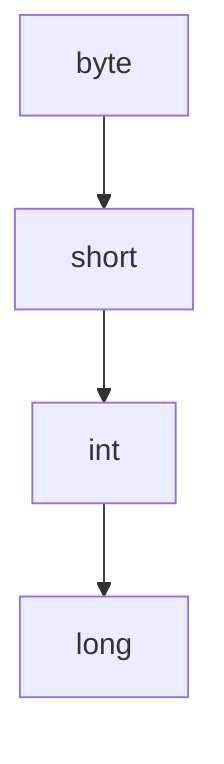
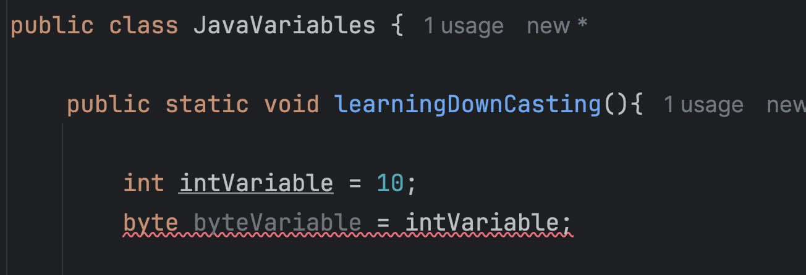

# Java Variables (Primitive)

## What is a variable?

- It is a container which can hold a value.
- How can we declare it?
  - \<DataType\>&nbsp; \<variableName\>  = \<value> 
  - e.g: boolean xyz = true

- Java is **static typed** language i.e it is mandatory to define the dataype of a variable.
- Java is a **strongly typed** language i.e there is a restriction on what value can be assigned to a variable.

## Variable Naming Convention

- Variable name is case-sensitive
- Variable name can be any legal identifier means can contain unicode letters and digits.
- Variable name can start with $, _ and letter.
- Variable name cannot be Java reserved keyword like "new", "class", "while"
- Variable should be in camelCase
- For constant, variable name should be defined in capital letters

## Types of Variables

### 1. Primitive Type
> 1. char
> 2. byte
> 3. short
> 4. int
> 5. long
> 6. float
> 7. double
> 8. boolean
### 2. Non-Primitive Type
> - class
> - interface
> - array
> - string
> - enum

### 1. char

- 2 bytes i.e 16 bits
- character representation of ASCII values
- Range: 0 to 235 - 1 (= 65535)  i.e. '\u0000' to '\uffff'
- Default value is '\u0000' i.e null

### 2. byte

- 1 byte i.e. 8 bits
- Signed 2s complement
- Range: -128 to 127
- default value is 0

> The first bit defines the sign of the number

> `1 0 1 1 0 0 1 0`

### 3. short

- 2 bytes i.e 16 bits
- signed 2s complement
- Range: -32768 to 32767
- default value is 0

### 4. int
- 4 bytes i.e. 32 bits
- Range: -231 to 231 - 1

### 5. long
- 8 bytes i.e. 64 bits
- signed 2s complement
- Range -263 to 263 - 1
- default value is 0
   
### 6. boolean
- 1 bit
- value : true or false
- default value is false

## Types of conversion:

### 1. Widening | Automatic conversion

- Automatic conversion when we go from lower data type to higher dataType

> e.g: 
> 
> `int var = 10;`
> 
> `long varLong = var;` // Automatically int will be converted to long

### 2. Narrowing/Downcasting/Explicit Conversion
- It is opposite of widening i.e. going from higher datatype to lower datatype
- In this case downcasting doesn't happen automatically. So we have to manually do it.
> e.g:
> int integerVariable = 10
> byte byteVariable = (byte) integerVariable;

> If we are downcasting beyond rang ethen it'll again reset to -128 and it goes on.
> So if integerVariable value is 128 then byteVariable's value will be -128 (Next after 127 is -128 for byte range)
> If it's 148 then byteVariable's value will be -108

