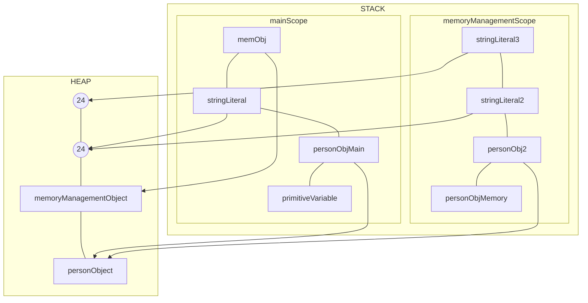

# Java Memory Management

- There are 2 types of memory which Java creates. JVM manages these both:
1. Stack
2. Heap

## Stack Memory

- Stack stores temporary variables and separate memory block for methods.
- Store primitive data types.
- Store reference of heap objects.
  - Strong reference
  - weak reference
- Each thread has its own stack memory
- Variables within a scope is only visible and as soon as any variable goes out of the scope, it gets deleted from the stack(in LIFO order)
- When stack memory goes full, it throws `java.lang.stackOverFlowError`

  ## Heap memory

  - Store objects and there is no order of allocating the memory
  - Garbage collector is used to delete unreferenced objects from the heap
    - Mark and sweep algorithm
    - Type of garbage Collector i.e serial GC, parallel GC, G1 GC, Concurrent Mark Sweep (CMS)
  - Heap memory is shared with all the threads.

  ## Example for better understanding

```
  public class MemoryMangement {

   public static void main(Strig args[]){
        int primitiveVariable = 10; //Primitive variable, will get stored in stack
        Person personObj = new Person(); //will get stored in heap and its reference will get stored in stack
        String stringLiteral = "24"; //this will get stored in heap
        MemoryManagement memObj = new MemoryManagement();
        memObj.memoryManagementTest(personObj); // this will move the context/scope to this funciton now
    }
   private void memoryManagementTest(Person personObj){
        Person personObj2 = personObj; // reference to object
        String stringLiteral2 = "24";
        String stringLiteral3 = new String("24");
   }
  }
```

```
First, the main method starts running, the stack for the same will get created.
```


```
  Once, we encounter memorymangementTest method, the new context will get started.
  Now as soon as we encounter the closing bracket fo memoryManagementTest method, its scope ends, it will delete its scope so the stack for the that method will get deleted.
  Now control comes back to main() method. Since nothing is there after calling that function, we encounter the closing bracket which means teh scope of main ends and its portion in stack beigns to be delted in LIFO order.
  So now the stack is cleared and all the references are deleted from the stack as well. Now the meory looks like this:
```
