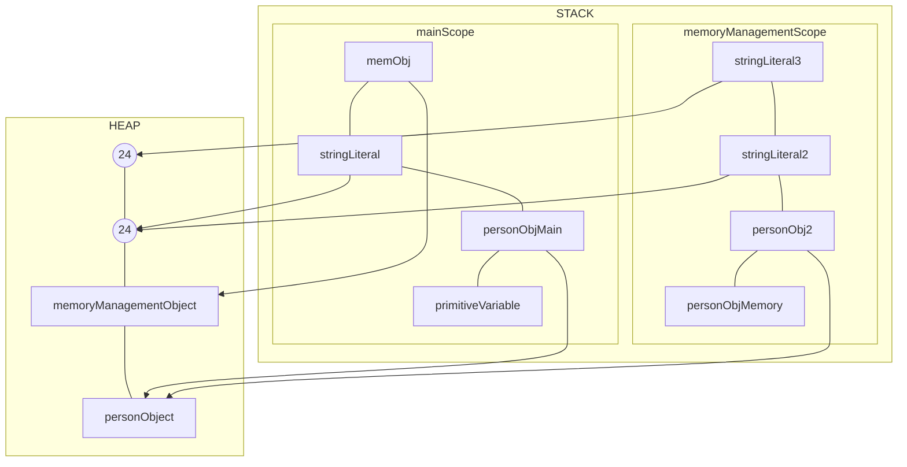
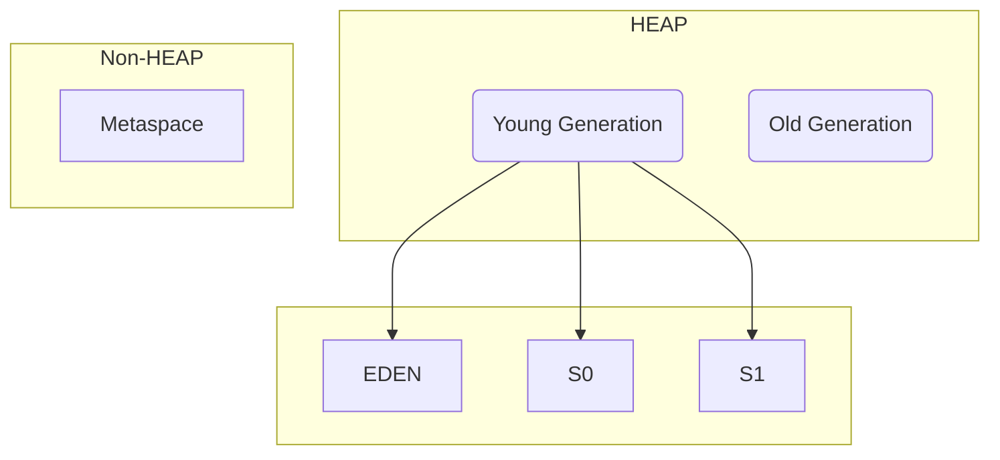
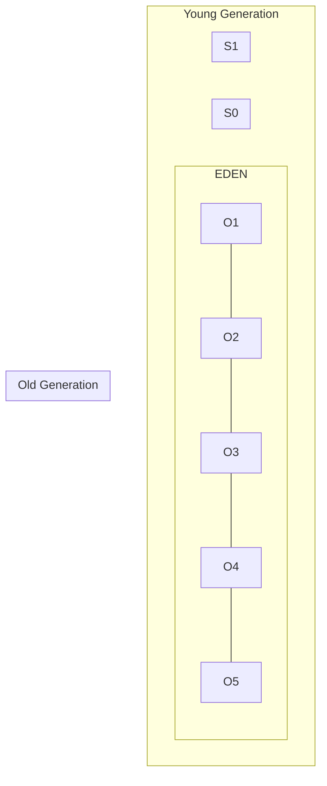
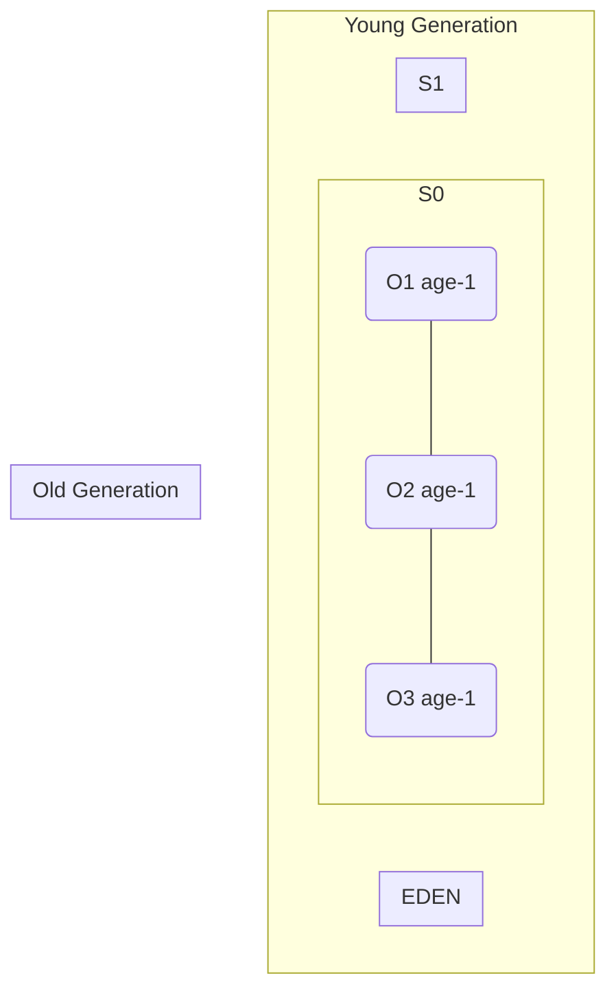
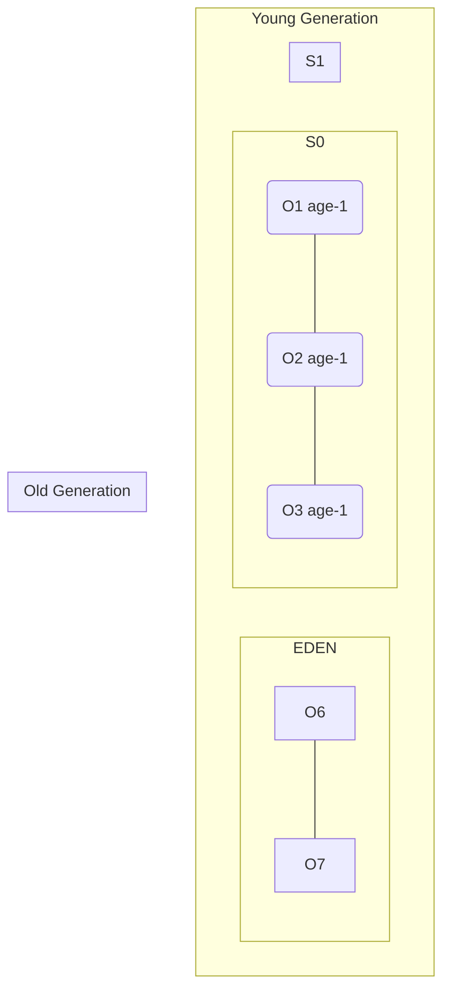
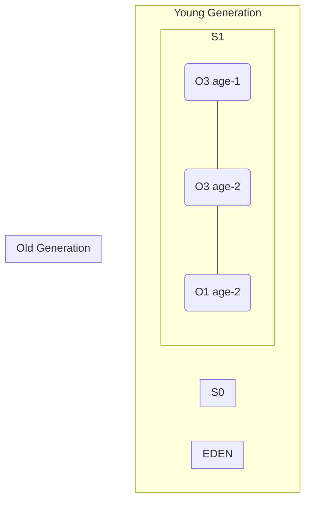

# Java Memory Management

- There are 2 types of memory which Java creates. JVM manages these both:
1. Stack
2. Heap

  ## Stack Memory

- Stack stores temporary variables and separate memory block for methods.
- Store primitive data types.
- Store reference of heap objects.
  - Strong reference
  - weak reference
- Each thread has its own stack memory
- Variables within a scope is only visible and as soon as any variable goes out of the scope, it gets deleted from the stack(in LIFO order)
- When stack memory goes full, it throws `java.lang.stackOverFlowError`

  ## Heap memory

  - Store objects and there is no order of allocating the memory
  - Garbage collector is used to delete unreferenced objects from the heap
    - Mark and sweep algorithm
    - Type of garbage Collector i.e serial GC, parallel GC, G1 GC, Concurrent Mark Sweep (CMS)
  - Heap memory is shared with all the threads.

  ## Example for better understanding

```java
  public class MemoryMangement {

   public static void main(Strig args[]){
        int primitiveVariable = 10; //Primitive variable, will get stored in stack
        Person personObj = new Person(); //will get stored in heap and its reference will get stored in stack
        String stringLiteral = "24"; //this will get stored in heap
        MemoryManagement memObj = new MemoryManagement();
        memObj.memoryManagementTest(personObj); // this will move the context/scope to this funciton now
    }
   private void memoryManagementTest(Person personObj){
        Person personObj2 = personObj; // reference to object
        String stringLiteral2 = "24";
        String stringLiteral3 = new String("24");
   }
  }
```

```
First, the main method starts running, the stack for the same will get created.
```


> Once, we encounter memorymangementTest method, the new context will get started.
> Now as soon as we encounter the closing bracket fo memoryManagementTest method, its scope ends, it will delete its scope so the stack for the that method will get deleted.
> Now control comes back to main() method. Since nothing is there after calling that function, we encounter the closing bracket which means teh scope of main ends and its portion in stack beigns to be delted in LIFO order.
> So now the stack is cleared and all the references are deleted from the stack as well. Now the meory looks like this:

> Now, the stack is cleared & all the references are deleted but the objects are in the heap. So that's where garbage collector's work comes.
> Garbage collector will delete all the unreferenced objects from the heap.

> Garbage collector runs periodically and JVM controls when to run the garbage collector. We can also tell the JVM to run the garbage collector using System.gc() but this doesn't guarantee that GC will run and that is why all of this called as automatic memory management.
> The frequency of GC is directly proportional to how much of the heap memory is currently full.


## Types of References

### Strong Reference
- It is when a variable in stack is referencing an object in Heap memory.
- Till the time the reference exists, GC won't be able to delete the object from the heap memory.
- e.g:
  ```java
  Person pobj = new Person();
  ```
> So here pobj has stron reference to a Person Object in the heap memory and till the time this reference exists, GC won't be able to delete Person object from Heap.

### Weak Reference
- In weak reference also the reference exists to an object in the heap but as soon as GC runs the object is deleted from heap memory even if some variable is referencing this object from the stack.
- The variable in the stack will get null if ti tries to access the object post GC run.
- For e.g:

```java

WeakReference<Person> weakObj = new WeakReference<Person>(new Person());
```
### Soft Reference

- It is a type of weak reference but the difference is that in this case the object will be deleted only when there is shortage of space in Heap. So GC is allowed for delete a soft reference but it'll keep the object if sufficient space is there in heap.


=> Reference can be changed by referencing a current object to a new variable:
e.g:

```java
Person obj1 = new Person();
Person obj2 = new Person();
obj1 = obj2;
```
> Now obj1 will have a reference for the object of obj2 in heap and when GC runs, the earlier object which obj1 was referring to will be deleted.

## Heap Memory

- Heap memory is divided into two parts i.e Young Generation and old Generation.
- There is also one more part which is generally known as Non Heap (Metaspace). Before Java 7 it is called premgen but now it is not used and is used as metaspace.
- Now Young generation is further divided into 3 parts named :
  - Eden
  - S<sub>0<sub> 
  - S<sub>1<sub>


> Now, let's see when we create an Object, what happens to it:
> Whenever a new object is created, it goes to Eden first. Let's say we've created 5 objects(O1, O2, O3, O4 and O5). They'll be created in Eden first.
> So, now heap memory looks like:


> So 5 objects are created inside Eden.
> Now let's say Garbage Collector run and there is no reference for O2 and O5 in the heap space. So now GC will use Mark and Sweep Algorithm i.e. in Mark GC will mark the objects which no more have reference and then sweep in which it'll do 2 things:
- First, remove dereferenced objects(O2 and O5) from the memory.
- Move the rest of survivor objects into one of the survivor space i.e S0 or S1 and add age to the objects. So after GC runs heap now look like this:

> Now GC has run once. This whole process is called minor GC as it happens very periodically and very fast.
Let's now create 2 more objects O6 and O7 So heap now looks like :

> O6 and O7 are now created iin Eden. Now let's say the GC ran again and this time no reference is there for O4 and O7. So Now GC will now do the following:
- Mark O4 and O7 
- Deletes O4 and O7 
- Moves O1, O6 and O7 (survivors) to S1 with corresponding ages 
- Therefore, post this minor GC, the heap looks like:


> So at one time Eden would be completely free after the GC and one of the survivor space (S0 or S1 ) would be
> free and we put data alternatively in S) and S1 along with respective age.


